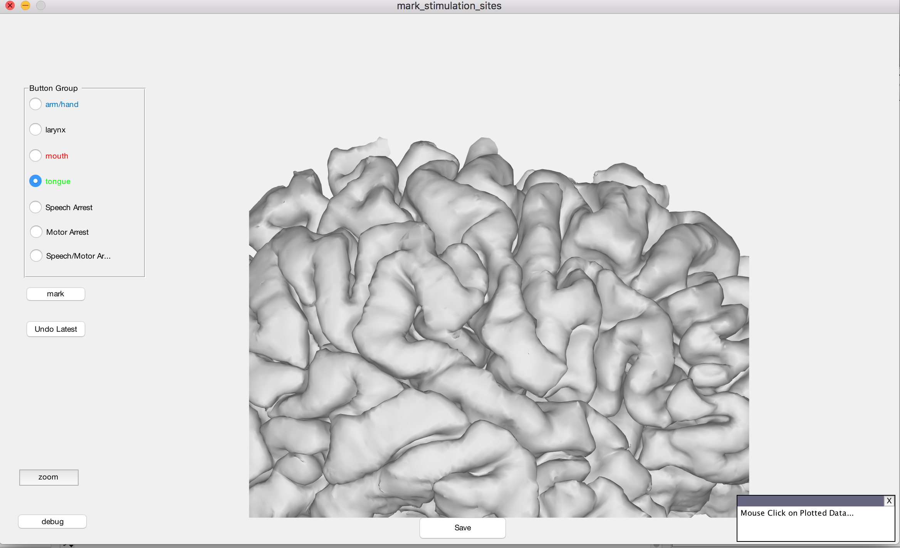

# mark_cortical_sites_matlab

GUI used to manually mark cortical sites on brain meshes created using [img_pipe](https://github.com/ChangLabUcsf/img_pipe).

## Requirements
[ctmr_gauss_plot](https://github.com/bendichter/ECoG_PPC_RecogMemory/tree/master/Plotting)

## Installation
```
git clone https://github.com/ChangLabUcsf/mark_cortical_sites_matlab.git
```
In `startup.m` add:
```matlab
addpath(genpath('path/to/mark_cortical_sites'));
```

## Usage
It is recommended that you mount one of the servers and use that as your mesh source (see [wiki](https://sites.google.com/site/ucsfchanglab/computational-resources/server-usage-tips))

In MATLAB:
```matlab
mark_stimulation_sites('EC61','rh','path/to/server_mount/data_store2/imaging/subjects/');
```


Select the type of reponse, select the region of brain you wish to mark, and press "mark." When you are done, press "save." Then, if you wish to warp, follow [this notebook](https://github.com/ChangLabUcsf/img_pipe/blob/compute_surface_warp/tutorials/img_pipe_warp_stim.ipynb).

## Authors
Ben Dichter

Jonathan Breshear
